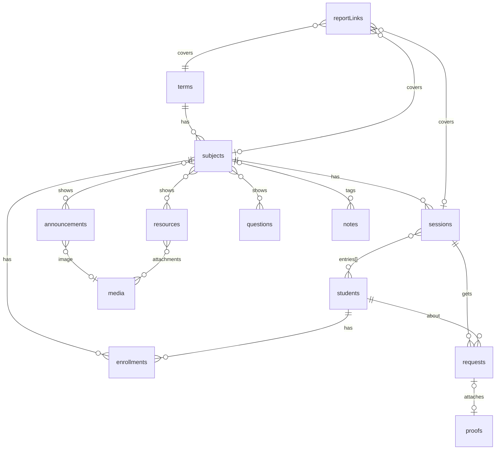

# SCHEMA.md: SuperSec v2 data schema

> SuperSec v2 · docs **v1.5** · Updated Sun Oct 4, 2026
> **The single source of truth for collections and fields.** Names follow `CONTEXT.md` (each heading gives the glossary word). Rules R1 to R9: PRD 1 §4.1. Who can do what: PRD 3 §1.1.
> **Keep in sync:** change this file in the same commit as the Payload collection config. Once code exists, `payload-types.ts` is generated from the config. If it disagrees with this file, stop and ask.

## 1. Conventions

1. Collection slugs are plural camelCase (`reportLinks`). Fields are camelCase.
2. **Dates vs instants:** fields named `date`, `…Date`, `…On`, or `…Until` are Asia/Manila `YYYY-MM-DD` **strings** (text field + pattern check). Fields named `…At` are UTC instants (Payload `date`). Times are `HH:mm` strings.
3. **Privacy tiers:** 🌐 Public · 📋 Report-only · 🔒 Private. **No mark = Private.** Each collection's `publicFields` = its 🌐 fields. Its `reportFields` = 🌐 + 📋. The privacy tests check against these lists.
4. Payload adds `id`, `createdAt`, and `updatedAt` to every document (all Private). Public URLs use `slug` or `date`, never `id`.
5. Imported v1 rows keep `legacyRowId` (= v1 `$id`, indexed, the upsert key) and `legacyId` (= v1 `publicId`, used by legacy redirects) where v1 had one. "Legacy fields" below = both, plus `legacyHistory[]` 🌐 (read-only imported v1 history).
6. Only Notes, Proofs, `rateLimits`, and v1 data are ever deleted. Everything else uses `archivedAt` (empty = active).
7. "Req" = required. "Req when …" = required only in that case.

## 2. Relationships

## 3. Collections

### Site settings: `site` (global)

| Field | Type | Req | Tier | Notes |
|---|---|---|---|---|
| className | text | ✓ | 🌐 | Shown on Class Home |
| siteName | text | ✓ | 🌐 | Browser title and Messenger previews |
| privacyContact | text | ✓ | 🌐 | How to ask for a correction (Privacy Notice) |

### Secretary account: `users` (auth)

| Field | Type | Req | Tier | Notes |
|---|---|---|---|---|
| email | email | ✓ | 🔒 | Login |
| name | text | ✓ | 🔒 | |
| role | select: `owner` (`helper` in Stage 4) | ✓ | 🔒 | Default `owner` |

Auth: `tokenExpiration: 2592000` (30 days).

### Term: `terms`

| Field | Type | Req | Tier | Notes |
|---|---|---|---|---|
| name | text | ✓ | 🌐 | e.g. "1st Sem AY 2026-2027" |
| startDate | date string | ✓ | | |
| endDate | date string | ✓ | | On or after `startDate` |

### Subject: `subjects`

| Field | Type | Req | Tier | Notes |
|---|---|---|---|---|
| term | relationship → `terms` | ✓ | | |
| name | text | ✓ | 🌐 | |
| code | text | ✓ | 🌐 | `OLCA113` |
| professor | text | | 🌐 | The Prof's display name |
| schedule | array (min 1) | ✓ | 🌐 | Each Meeting: `weekday` (select `mon`…`sun`), `start`, `end` (`HH:mm`). Max 1 per weekday (R8) |
| sectionMark | text | | 🌐 | `N001` |
| sectionFull | text | | 🌐 | `OLCA113N001` |
| slug | text, unique | ✓ | 🌐 | Auto: lowercase code + `-` + 4 random chars (`olca113-k7q2`). Never changes |
| room | text | | 🔒 | |
| zoomUrl | text | | 🔒 | |
| absenceLimit | number | | | Optional. Empty = the 20% rule (R6) |
| archivedAt | date | | | |
| legacy fields | | | | |

### Student: `students`

| Field | Type | Req | Tier | Notes |
|---|---|---|---|---|
| lastName | text | ✓ | 🌐 | |
| firstName | text | ✓ | 🌐 | |
| middleName | text | | 🌐 | Shown as an initial: `DELA CRUZ, Juan M.` |
| studentNumber | text | | 📋 | Only if the sample PDFs need it |
| privateNotes | textarea | | 🔒 | The Private note |
| legacyRowId | text, indexed | | | |

### Enrollment: `enrollments`

| Field | Type | Req | Tier | Notes |
|---|---|---|---|---|
| student | relationship → `students` | ✓ | | |
| subject | relationship → `subjects` | ✓ | | |
| status | select: `active` / `dropped` | ✓ | 📋 | Default `active`. Reports show "Dropped" |
| enrolledOn | date string | ✓ | | Default: the day you enroll them. Import: Term start |
| droppedOn | date string | Req when dropped | | **New in v1.5.** Stats stop counting after this day |
| conflictFlag | checkbox | | 🔒 | The Conflict flag |
| displayOrder | number | | | "Original order" sort (R9) |
| legacyRowId | text, indexed | | | |

Unique: (`student`, `subject`).

### Session: `sessions`

| Field | Type | Req | Tier | Notes |
|---|---|---|---|---|
| subject | relationship → `subjects` | ✓ | | |
| date | date string | ✓ | 🌐 | A Class day |
| kind | select: `class` / `noClass` | ✓ | 🌐 | |
| phase | select: `live` / `finished` | ✓ | | Default `live`. No Class Sessions are saved as `finished` |
| noClassReason | text | Req when `noClass` | 🌐 | Holiday, Suspension, or your own text |
| entries | array | | 🌐 | 1 per Active Enrollment when the Session starts |
| entries[].student | relationship → `students` | ✓ | 🌐 | Unique within the Session |
| entries[].attendance | select: `P` / `A` / `E`, or empty | | 🌐 | Empty = Not set (`–`) |
| entries[].recitations | number, 0 or more | | 🌐 | Default 0 |
| entries[].recitationTopic | text | | 🌐 | The Topic |
| changeNote | text | Req at Publish | 🌐 | |
| legacy fields | | | | |

Unique: (`subject`, `date`). Versions: `{ drafts: { autosave: true }, maxPerDoc: 0 }`. Payload's `_status` (`draft` / `published`) is the **only** published flag.

**Session states → data:**

| State (CONTEXT word) | Data |
|---|---|
| Upcoming | No document. Computed from the schedule ("virtual session" in code) |
| Live | `phase: live` |
| Finished | `phase: finished`, never published |
| Published | `_status: published` |
| Unpublished edits | Published, plus a newer autosaved draft |
| No Class | `kind: noClass`, published right away |

### Request: `requests`

| Field | Type | Req | Tier | Notes |
|---|---|---|---|---|
| subject | relationship → `subjects` | ✓ | | |
| session | relationship → `sessions` | ✓ | | |
| student | relationship → `students` | ✓ | | The name the Classmate picked |
| type | select: `present` / `excuse` / `recited` | ✓ | | UI: I was present · Excuse · I recited |
| reason | textarea | Req when `excuse` | 🔒 | The excuse reason |
| count | number, 1 or more | Req when `recited` | | Default 1. Added to recitations on approval (R5) |
| topic | text | | | `recited` only |
| proof | upload → `proofs` | | 🔒 | Optional |
| status | select: `pending` / `approved` / `declined` / `expired` | ✓ | | Default `pending` |
| decidedAt | date | | | Set on Approve or Decline |

Created **only** by `POST /api/requests/submit`. No public read at all.

### Announcement: `announcements`

| Field | Type | Req | Tier | Notes |
|---|---|---|---|---|
| subjects | relationship → `subjects`, hasMany | ✓ | | Max 1 until Stage 3 (cross-posting) |
| title | text | ✓ | 🌐 | |
| slug | text, unique | ✓ | 🌐 | **New in v1.5.** Auto: title words + `-` + 4 random chars. Never changes |
| body | richText (Lexical) | | 🌐 | PRD 1 §4.2 |
| image | upload → `media` | | 🌐 | |
| priority | checkbox | | 🌐 | |
| pinnedUntil | date string | Req when `priority` | | The pin end date |
| publishedAt | date | | 🌐 | **New in v1.5.** Set at the first Publish. Import: v1 created date. Sorts "latest" |
| changeNote | text | Req at Publish | 🌐 | |
| archivedAt | date | | | |
| legacy fields | | | | |

Versions: `{ drafts: true, maxPerDoc: 0 }` (same for all Posts).

### Resource: `resources`

| Field | Type | Req | Tier | Notes |
|---|---|---|---|---|
| subjects | relationship → `subjects`, hasMany | ✓ | | Max 1 until Stage 3 |
| title | text | ✓ | 🌐 | |
| slug | text, unique | ✓ | 🌐 | **New in v1.5.** Same rule as Announcements |
| url | text (URL check) | | 🌐 | |
| category | text | | 🌐 | Carries v1's category/resourceType |
| attachments | upload → `media`, hasMany, max 6 | | 🌐 | |
| body | richText (Lexical) | | 🌐 | |
| publishedAt | date | | 🌐 | **New in v1.5** |
| changeNote | text | Req at Publish | 🌐 | |
| archivedAt | date | | | |
| legacy fields | | | | |

### Question: `questions`

| Field | Type | Req | Tier | Notes |
|---|---|---|---|---|
| subjects | relationship → `subjects`, hasMany | ✓ | | Max 1 until Stage 3 |
| question | text | ✓ | 🌐 | |
| slug | text, unique | ✓ | 🌐 | **New in v1.5.** From the question words |
| answer | richText (Lexical) | | 🌐 | |
| tags | text, hasMany | | 🌐 | |
| official | checkbox | | 🌐 | The Official badge |
| publishedAt | date | | 🌐 | **New in v1.5** |
| changeNote | text | Req at Publish | 🌐 | |
| archivedAt | date | | | |
| legacy fields | | | | |

### Note: `notes` 🔒 (whole collection)

| Field | Type | Req | Tier | Notes |
|---|---|---|---|---|
| title | text | ✓ | 🔒 | |
| body | richText (Lexical) | | 🔒 | |
| subject | relationship → `subjects` | | 🔒 | Optional tag |

Owner only. Can be deleted. Never public, never sent to AI.

### Report link: `reportLinks` 🔒

| Field | Type | Req | Tier | Notes |
|---|---|---|---|---|
| type | select: `session` / `subject` / `compiled` | ✓ | | |
| term | relationship → `terms` | ✓ | | |
| subject | relationship → `subjects` | Req when `session` or `subject` | | |
| session | relationship → `sessions` | Req when `session` | | |
| fromDate · toDate | date strings | | | **New in v1.5.** The range picked on S11. Empty = the whole Term so far |
| token | text, unique | ✓ | | 32+ random chars. Used in `/prof/[token]` |
| revokedAt | date | | | Set on Reset. The link then shows "Link expired" |

Reset = set `revokedAt`, then create a new link.

### Rate limit: `rateLimits`

| Field | Type | Req | Tier | Notes |
|---|---|---|---|---|
| key | text, unique | ✓ | | e.g. hashed IP + route |
| count | number | ✓ | | |
| expiresAt | date, TTL index | ✓ | | Cleans itself up |

### Image or file: `media` (upload, Appwrite bucket `images`)

| Field | Type | Req | Tier | Notes |
|---|---|---|---|---|
| file | upload | ✓ | 🌐 | Public read, no public write, random file IDs, served with `/view` URLs, 300 KB or less after browser compression |
| alt | text | ✓ | 🌐 | **New in v1.5.** Describes the image for screen readers. Import fallback: the Post title |

### Proof file: `proofs` (upload, Appwrite bucket `proofs`) 🔒

| Field | Type | Req | Tier | Notes |
|---|---|---|---|---|
| file | upload | ✓ | 🔒 | No public permissions. Deleted 30 days after the decision (R4) |

## 4. Calculated, never stored

The stats module computes these on read. Plain-language definitions and thresholds: `CONTEXT.md` → Stats and monitoring.

| Value | Built from |
|---|---|
| Held sessions | `sessions` with `_status: published`, `kind: class`, `date` inside the Term, and `enrolledOn` ≤ `date` ≤ `droppedOn` (if dropped) |
| Attendance % | `entries[].attendance` across Held sessions |
| Absence limit | `subjects.absenceLimit`, else the 20% rule over the Term's Class days |
| Flags | The above, per Enrollment |

## 5. v1 → v2 map

| v1 table | v2 | Notes |
|---|---|---|
| subjects | `subjects` | termName → `term`, meetingDaysJson → `schedule`, viewOnlyShortMark / viewOnlyName → `sectionMark` / `sectionFull` |
| students | `students` | |
| subjectStudents | `enrollments` | membershipState / removedAt → `status: dropped` + `droppedOn` (Manila date). hasScheduleConflict → `conflictFlag`. `enrolledOn` = Term start |
| classSessions | `sessions` | `startsAt` → Asia/Manila date. sessionState / noClassReason → `kind` |
| attendanceRecords | `sessions.entries[]` | excuseReason → 🔒 `reason` on a matching approved Request |
| announcements · resources · questionsAnswers | `announcements` · `resources` · `questions` | Bodies → Lexical. `slug` generated, `publishedAt` = v1 created date |
| mediaAssets | `media` | Download each `servedUrl`, re-upload, `alt` = Post title |
| historyEntries (supersec_history_db) | `legacyHistory[]` | On the matching document |
| attendanceProofSubmissions | (by hand) | Check for pending items before Switch-over |
| users · reports · zoomImports · zoomMatchSuggestions · pushSubscriptions | not imported | v2 has its own login. `pushSubscriptions` rows get deleted at Switch-over |
