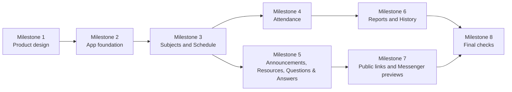

# Class Management System — Build Milestones

**Status:** Ready for MJ Balubar’s review and approval  
**Basis:** Approved Information Architecture and Product Requirements Document  
**Rule:** Product design and implementation begin only after this milestone plan is approved.

## Build order at a glance

The plan starts with product design, then builds the common foundation before subject-specific work. Attendance and class content can proceed after Subjects and Schedule exist. Reports depend on published Attendance. Public sharing and Messenger previews depend on published content and stored media. The final milestone tests the complete workflow rather than isolated pages.

## Milestone 1 — Product design

**Outcome:** A mobile-first, dark-mode-first product design that uses the approved simple labels and prepares the app for Apple-inspired typography and interaction.

| Included | Done when |
|---|---|
| Dark-mode-first visual direction | The default dark theme has approved text, background, status, and focus rules. |
| Mobile navigation | The flow between Dashboard, Subjects, Home, Attendance, Announcements, Resources, Questions & Answers, Schedule, Sharing, and Settings is designed for phone use. |
| Subject Home | The design always shows subject name, code, professor, Schedule, and No Class notice. |
| Core states | Empty, loading, error, published, updated, and unavailable states are designed for the main pages. |
| Accessibility baseline | Touch target, contrast, keyboard, readable type, reduced-motion, and reduced-transparency rules are specified. |

**Depends on:** Approved PRD and Information Architecture.  
**Approval gate:** MJ approves the product design direction before implementation begins.

## Milestone 2 — App foundation

**Outcome:** A secure base for secretary-only management and public view-only pages.

| Included | Done when |
|---|---|
| Secretary sign-in | The secretary can access protected management pages. |
| Public view-only pages | Public pages can be opened without sign-in and do not show private data. |
| Data foundation | The app can keep Subjects, Students, class sessions, Attendance, content, Reports, History, and media references. |
| Common History rules | Published items can have version numbers and public change summaries. |
| Dark theme foundation | The approved dark theme and typography work across the app shell. |

**Depends on:** Milestone 1.  
**Verification gate:** Public/private access checks and data-model tests pass.

## Milestone 3 — Subjects, Students, and Schedule

**Outcome:** The secretary can set up and manage each Subject as its own area.

| Included | Done when |
|---|---|
| Subject setup | A secretary can create and edit subject name, code, professor, and fixed weekday Schedule. |
| Students | Every Subject keeps its own Students list without changing another Subject’s list. |
| Class sessions | The app creates normal class sessions from fixed weekdays. |
| No Class | The secretary can publish a No Class notice for holidays, school events, weather, or custom reasons. |
| Subject Home | Home shows the required subject details and the current No Class notice or next class session. |
| Archive | An archived Subject keeps its published information and History. |

**Depends on:** Milestone 2.  
**Verification gate:** Create two Subjects with different Students and Schedules; confirm that their information remains separate in public and secretary views.

## Milestone 4 — Attendance

**Outcome:** The secretary can turn a pasted Zoom participant list into reviewed and published Attendance for one class session.

| Included | Done when |
|---|---|
| Zoom-name input | The secretary can paste names and save the capture time. |
| LLM name suggestions | The app suggests matches using `SECTION_LAST NAME, FIRST NAME + MIDDLE NAME` and clearly separates clear, unclear, and unmatched names. |
| Secretary confirmation | The secretary must review suggestions before official Attendance is published. |
| Official statuses | Only PRESENT, ABSENT, and NOT SET are available. |
| Public Attendance | Published Attendance can be viewed publicly, while raw Zoom names and secretary notes remain private. |
| Attendance History | A later correction creates a new version and public change summary. |

**Depends on:** Milestone 3.  
**Verification gate:** Run a realistic pasted-name test containing an exact match, an unclear match, an unmatched name, and a manual status correction. Confirm that no private source data appears publicly.

## Milestone 5 — Announcements, Resources, and Questions & Answers

**Outcome:** The secretary can publish class information once and share it many times.

| Included | Done when |
|---|---|
| Announcements | The secretary can create, edit, publish, and archive rich Announcements with media and History. |
| Resources | The secretary can publish visual Resource cards with title, description, category, type, source/domain, link, thumbnail or fallback image, and History. |
| Questions & Answers | The secretary can publish, update, mark official, search, and share individual Questions & Answers. |
| Media | Announcement media, fallback thumbnails, and preview images are stored securely and used only where the secretary allows. |
| Subject Home updates | Recent content appears on Home without replacing the dedicated pages. |

**Depends on:** Milestone 3 and the media part of Milestone 2.  
**Verification gate:** Publish one item of each type, update it once, confirm its History, and test a Resource with no external thumbnail.

## Milestone 6 — Reports and History

**Outcome:** The secretary can produce correct reports from published Attendance and show clear public update history.

| Included | Done when |
|---|---|
| Class Attendance | A report is available after each class session for the selected Subject. |
| All Subject Attendance | A report combines end-of-exams Attendance across Subjects while keeping Students separate by Subject. |
| Share and export | The secretary can share a view-only report link and open a print-friendly view. |
| History checks | Attendance, Announcements, Resources, and Questions & Answers show version number and public change summary. |

**Depends on:** Milestone 4; History foundation from Milestone 2.  
**Verification gate:** Generate both report types after at least two Subjects have published Attendance, then verify totals and Subject separation.

## Milestone 7 — Public links and Messenger previews

**Outcome:** Public pages are easy to share through Messenger and show the intended preview without exposing private data.

| Included | Done when |
|---|---|
| View-only links | Home, Announcements, Resources, Questions & Answers, and Reports have stable public links. |
| Messenger text | The secretary can copy a short, clear message with the item title and link. |
| Previews | Shareable pages provide a title, description, image or fallback image, and clear Subject identity. |
| Privacy rules | Attendance previews do not include raw Zoom names, private notes, or other sensitive details. |
| Preview checks | The secretary has a simple way to verify or refresh a preview after an update. |

**Depends on:** Milestone 5 for content pages, Milestone 6 for reports, and stored media.  
**Verification gate:** Test every public page type in a Messenger-style preview check and confirm that private information is not present.

## Milestone 8 — Final checks and release readiness

**Outcome:** The end-to-end secretary and classmate experience is ready for the first release.

| Included | Done when |
|---|---|
| End-to-end test | The secretary can create a Subject, add Students, record Attendance, publish class information, generate a report, and share public links. |
| Mobile test | Core public pages work on a phone-sized screen. |
| Accessibility test | Keyboard, focus, contrast, touch target, reduced-motion, and reduced-transparency checks pass. |
| Data safety test | Public pages hide private data, and LLM suggestions cannot publish without secretary confirmation. |
| Quality test | Empty, loading, error, unavailable, and update states have clear recovery actions. |
| Release decision | MJ reviews the completed workflow and decides whether the first release is ready to publish. |

**Depends on:** Milestones 4, 5, 6, and 7.  
**Verification gate:** All acceptance checks pass and no blocking privacy or Attendance issue remains.

## What does not happen until later

The following work is deliberately outside this milestone plan: direct Zoom integration, automatic screenshot OCR, Messenger automation, private student-specific links, grading, assignment submission, private chat, professor editing, and school-wide account management. These items can be considered only after the first release proves useful.

## Approval checklist

Approve this plan if the sequence is correct: product design first; common app foundation next; Subjects and Schedule before Attendance and content; Reports after Attendance; public Messenger sharing after public content; and final testing only after all core workflows exist. Approval permits the work to begin at **Milestone 1 — Product design**.
