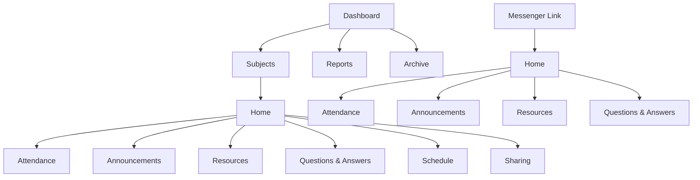

# Class Management System — Information Architecture

**Status:** Awaiting MJ Balubar’s approval before product design begins.

## 1. Architecture purpose and approval boundary

This architecture organizes a reusable class-secretary app rather than a full learning-management system. It supports any number of independent subjects, each with its own Students list, fixed weekday Schedule, class sessions, Attendance, Announcements, Resources, Questions & Answers, History, and Reports. The initial use case has three subjects, but the structure must not assume a fixed number of subjects or a particular timetable.

The document defines **what exists, where it lives, who can see it, and how it relates**. It intentionally does not define visual layouts, colors, components, screen styling, or implementation details; those belong to the product-design stage after approval.

## 1.1 Simple labels

The app will use these familiar names in navigation and public pages: **Dashboard, Subjects, Reports, Archive, Home, Attendance, Announcements, Resources, Questions & Answers, Schedule, Sharing, Settings, No Class, History, and Students**. The system will avoid custom labels for these areas.

## 1.2 Dark mode first

Product design will use dark mode as the default. The information structure stays the same in every theme, but the later design must keep text easy to read, make important actions clear, and provide a reduced-transparency option for people who need it.

## 2. Users, access, and information boundaries

| Audience | Primary intent | Access model | What they can see | What they cannot change |
|---|---|---|---|---|
| **Secretary** | Manage and publish class information | Signed-in owner area | All subjects, Students, raw Zoom names, matching suggestions, History, Reports, and publishing controls | Nothing is intentionally restricted in the personal secretary area |
| **Classmate** | Find current class information and check published Attendance | Public, view-only link shared through Messenger to a small class group | Home, Schedule, No Class notices, published Attendance, Announcements, Resources, Questions & Answers, and History | Students list, raw Zoom names, unclear matching suggestions, secretary notes, and publishing controls |
| **Professor** | Receive an attendance report and review published class information | Public report or subject link when shared by the secretary | Shared reports and published subject information | Attendance editing and in-app commenting; feedback continues through Zoom or Messenger |

> **Approved working assumption:** public links are acceptable for the intended small class group. Public views should still exclude raw import data, internal notes, and unreviewed attendance matching decisions.

## 3. The primary objects

The application is organized around objects and their lifecycle, not around disconnected screens. Every public page is a view of one or more of these objects.

| Object | Created by | Essential contents | Lifecycle | Public relationship |
|---|---|---|---|---|
| **Subject** | Secretary | Name, code, professor, fixed weekdays, active term, independent roster, no-class events | Draft → Active → Archived | Subject home is the public entry point |
| **Student** | Secretary | Name in `SECTION_LAST NAME, FIRST NAME + MIDDLE NAME` format, subject membership, name variations | Active → Removed from future classes → History retained | Name appears only where published Attendance needs it |
| **Class session** | Generated from a subject’s fixed weekday schedule or added by secretary | Date, weekday, capture time, attendance state, no-class state, report link | Scheduled → Draft attendance → Published → Updated; or Scheduled → No Class | Public session detail becomes the Class Attendance view |
| **No Class** | Secretary | Reason: holiday, school event, weather, or custom reason; affected date; note | Draft → Published → Archived | Appears prominently on the affected subject home and Schedule page |
| **Zoom names** | Secretary | Pasted Zoom participant names, capture time, normalized suggestions, unclear/unmatched entries | Draft → Reviewed → Confirmed | Never public as raw data |
| **Attendance** | Secretary confirmation after review | Student, class session, status: PRESENT / ABSENT / NOT SET, version number | NOT SET → PRESENT or ABSENT → Updated if necessary | Published through class session and subject Attendance views |
| **Announcement** | Secretary | Rich text, media, title, publish state, social-preview details, History | Draft → Scheduled or Published → Archived | Listed on Home and individual public Announcement page |
| **Resource** | Secretary | Title, description, category, type, source/domain, link, thumbnail/fallback image, History | Draft → Published → Archived | Listed in Resources and individual public Resource page |
| **Question & Answer** | Secretary | Question, answer, tags, official state, share link, History | Draft → Published → Official or Updated → Archived | Listed in Questions & Answers and individual shareable page |
| **Report** | Secretary | Per-session Class Attendance report or end-of-exams All Subject Attendance report | Generated → Shared → Superseded if corrected | Opened through a shared public report link |
| **History** | System when secretary publishes an update | Item type, version number, timestamp, public change summary | Kept as a historical record | Visible in the relevant item’s History; excludes private notes |

## 4. Top-level navigation model

The secretary workspace and public subject experience use different navigation because they have different jobs. The secretary needs cross-subject operations and publishing controls; classmates need a quick, predictable subject-level destination from Messenger.

### 4.1 Secretary workspace

| Destination | Primary question answered | Primary action | Contents |
|---|---|---|---|
| **Dashboard** | What needs my attention across all subjects? | Open a subject or create a record | Subject cards, next sessions, no-class notices, incomplete attendance, recent publications, report shortcuts |
| **Subjects** | Which class am I managing? | Open or create a subject | Active subject list, subject code, professor, schedule, roster count, publication status |
| **Reports** | Which report do I need to share? | Generate or share report | Per-session reports grouped by subject and end-of-exams all-subject report |
| **Archive** | What historical class records do I need to revisit? | Restore or view archive | Archived subjects and their full retained content |

### 4.2 Subject pages

Each subject has its own pages. The header must always show the **subject name, subject code, professor name, fixed weekday Schedule, and next published No Class notice**, so the subject is always clear.

| Page | Primary question answered | Contents | Public availability |
|---|---|---|---|
| **Home** | What is important for this subject now? | Subject details, Schedule/No Class notice, latest Announcement, quick links, recent Resources, recent Questions & Answers, next/last class session | Yes |
| **Attendance** | What happened in each class session? | Class session list, Zoom-name review, published Class Attendance, History | Published Attendance only |
| **Announcements** | What official updates were posted? | Rich posts with date, media, History, and individual share pages | Yes |
| **Resources** | What links and materials are available? | Searchable visual links with details and individual share pages | Yes |
| **Questions & Answers** | Has this question already been answered? | Searchable questions and answers, official state, tags, share pages, History | Yes |
| **Schedule** | When do we meet and when is there no class? | Fixed weekdays, upcoming class sessions, published No Class notices | Yes |
| **Sharing** | What will classmates see when I send a link? | Public links, Messenger text, preview details, preview image controls | Secretary only |
| **Settings** | How is this subject defined? | Core details, roster, fixed weekdays, archive state | Secretary only |

## 5. Public subject-home information hierarchy

Home is the default destination for a Messenger link. It must answer “What class is this, when do we meet, and where is the information I need?” before showing secondary content.

1. **Subject identity:** subject name, subject code, professor name, and fixed weekday schedule.
2. **Urgent context:** the next no-class notice, if any; otherwise the next scheduled class session.
3. **Primary destinations:** Attendance, Announcements, Resources, and Questions & Answers.
4. **Current content:** newest Announcement, recent Resources, and useful Questions & Answers.
5. **History:** “last updated” timestamp and links to public History where relevant.

This hierarchy keeps the expected student actions simple while keeping older information easy to find. A shared link to an Announcement, Resource, or Question & Answer must include an obvious route back to Home.

## 6. Core secretary and public flows

### 6.1 Create and activate a subject

**Trigger:** the secretary starts a new subject.

1. Enter subject name, subject code, professor name, and fixed weekday Schedule.
2. Add the Students list using the class-name format.
3. Review the generated upcoming sessions.
4. Add any known no-class events.
5. Activate the Subject and publish Home.

**Likely deviations:** a class has no roster yet, so the subject remains active but attendance actions prompt for roster setup; or a schedule changes, so the secretary adds a no-class event or rescheduled session rather than overwriting history.

### 6.2 Record attendance from a Zoom participant list

**Trigger:** the secretary captures a Zoom screenshot or participant list at a chosen time.

1. Open the correct subject and session.
2. Paste participant names and record the capture time.
3. Request name suggestions.
4. Review clear matches, unclear matches, and unmatched names.
5. Confirm the final decisions and assign PRESENT, ABSENT, or NOT SET for each Student.
6. Publish the session’s Class Attendance record, creating the next public version if it was previously published.

**Critical boundary:** the LLM proposes; only the secretary confirms. Ambiguous and unmatched names cannot silently become attendance records.

### 6.3 Publish class information

**Trigger:** the secretary needs to share an announcement, resource, or resolved question.

1. Create an Announcement, Resource, or Question & Answer inside the correct Subject.
2. Add complete metadata, body/link/media, and a public change summary.
3. Review the version number and social-preview content.
4. Publish the record.
5. Copy the Messenger-ready view-only link and send it to the class group.

**Failure state:** if a resource has no safe preview image or a destination blocks thumbnail access, use the designed fallback image and preserve the title, domain, type, and description.

### 6.4 Find information from Messenger

**Trigger:** a classmate opens a shared subject or individual-content link.

1. Read the subject identity and current no-class/schedule status.
2. Use the primary destination or view the linked item.
3. Search Resources or Questions & Answers when needed.
4. Open Attendance to find the relevant class session.
5. Return to the subject home from any deep-linked page.

### 6.5 Generate a professor report

**Trigger:** a class session ends or exams are complete.

1. Generate **Class Attendance** for one completed subject session.
2. Review the attendance version and share the report link or export.
3. At the end of exams, generate **All Subject Attendance**, combining independent subject attendance without merging subject rosters.
4. Share the report with the professor; any feedback continues in Zoom or Messenger.

## 7. Publishing and History

All user-facing content uses the same publication model so that classmates can understand whether information is current.

| Content type | Secretary action | Public state | History |
|---|---|---|---|
| Attendance | Confirm, then publish class session status | Published Attendance | Version number and public change summary; raw Zoom names remain private |
| Announcement | Publish post | Published Announcement | Version number, publication time, and update summary |
| Resource | Publish link | Published Resource | Version number, update summary, and changed link if applicable |
| Question & Answer | Publish or mark official | Published/official Question & Answer | Version number, update summary, and official status change |
| No Class | Publish notice | Active No Class notice | Created/updated time and reason |

## 8. Information architecture decisions

| Decision | Alternatives considered | Chosen structure and rationale | Assumption to validate in product design |
|---|---|---|---|
| **Subject as the main area** | One universal feed; separate apps per subject | Independent subjects keep students, schedules, attendance, and content clear while allowing a cross-subject Dashboard | Users switch between subjects more often than they need a universal feed |
| **Home as the Messenger destination** | Direct-only links; public Dashboard | A stable Home makes any shared link understandable and provides an escape route from deep content | Classmates mostly arrive from Messenger on mobile |
| **Attendance is session-first** | One aggregate attendance table | Sessions preserve capture timing, corrections, reports, and class-specific context | The secretary records attendance after each class session |
| **LLM matching is advisory** | Fully automatic matching; manual-only cleanup | AI reduces repetitive name cleanup, but confirmation prevents incorrect official records | Pasted Zoom names follow a consistent enough format to make suggestions useful |
| **Questions & Answers is not chat** | Built-in chat; static FAQ | Messenger stays the place to ask; published questions and answers reduce repeated replies and support sharing | The secretary can curate recurring questions manually |
| **Resources are cards, not raw URLs** | Plain list; attachments-only library | Cards make links recognizable on a phone and preserve metadata when a thumbnail fails | Most resources are external links rather than uploaded documents |
| **History for public updates** | No History; secretary-only notes | A short public History builds trust in updates without exposing internal notes | Classmates benefit from seeing that an item changed |
| **Fixed weekdays plus no-class events** | Fully irregular scheduling UI | The primary schedule remains simple while cancellations handle holidays, events, and weather | Each subject normally follows a repeatable weekday pattern |

## 9. Explicit non-goals for the first release

The first release is not a school-wide student information system. It does not include grading, assignment submission, private in-app chat, direct Messenger automation, direct Zoom integration, fully automated OCR, professor editing, or formal institutional retention/compliance workflows. It also does not promise private individual attendance links because the approved initial sharing model is public within a small group.

## 10. Approval checklist

Approval of this architecture confirms the following before product design begins:

- Dashboard, Subjects, and Home are the correct three structural levels.
- A subject home always presents subject code, professor, fixed weekday schedule, and no-class notice.
- Attendance is organized by class session and uses PRESENT, ABSENT, and NOT SET.
- LLM name matching is advisory and secretary confirmation controls official attendance.
- Public view-only links and Messenger distribution are the right initial access pattern.
- Announcements, Resources, and Questions & Answers are separate content types with their own History and individual share links.
- Per-session Class Attendance and end-of-exams All Subject Attendance are the correct report levels.
- Product design may proceed only after this structure is approved or revised.
